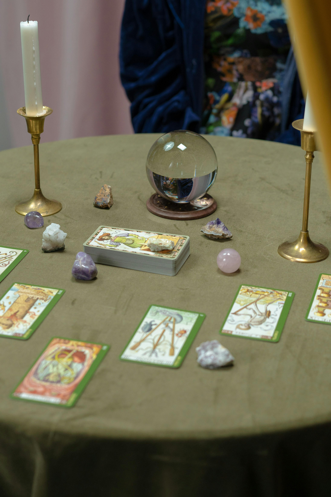

# Prácticas Cartománticas de Uso Práctico

**Gaius Jocundus & Thalia Ephemera** — 2026  
Licencia [CC BY 4.0](LICENSE) — libre para uso comercial con atribución.

---

Guía de referencia práctica para cuatro sistemas cartománticos occidentales, ordenados de forma descendente de lo cosmológico a lo circunstancial. Cada capítulo es una referencia independiente; el capítulo final aborda la pregunta de qué instrumento usar y cuándo.

---

## Índice

### [Introducción](epub_intro.md)

---

### Capítulo 1: Tarot Mágico de la Golden Dawn (Cicero)

*Prefacio:* [El Instrumento más Exigente](epub_preface_gd.md)

**[Tarot Mágico de la Golden Dawn — Referencia completa](golden_dawn_magical_tarot.md)**

- [Principios de Funcionamiento](golden_dawn_magical_tarot.md#principios-de-funcionamiento)
- [El Mapa Estructural](golden_dawn_magical_tarot.md#el-mapa-estructural)
- [Los Palos y Sus Correspondencias](golden_dawn_magical_tarot.md#los-palos-y-sus-correspondencias)
- [El Marco Cabalístico](golden_dawn_magical_tarot.md#el-marco-cabalístico)
  - Las Sefirot y los Arcanos Menores
  - YHVH y las Cartas de la Corte
- [Los Arcanos Mayores](golden_dawn_magical_tarot.md#los-arcanos-mayores)
- [Los Ases](golden_dawn_magical_tarot.md#los-ases)
- [Las Cartas de la Corte](golden_dawn_magical_tarot.md#las-cartas-de-la-corte)
  - Reyes — Yod, Fuego del palo
  - Reinas — Heh, Agua del palo
  - Príncipes — Vau, Aire del palo
  - Princesas — Heh final, Tierra del palo
- [Los Arcanos Menores: Cartas Numéricas 2–10](golden_dawn_magical_tarot.md#los-arcanos-menores-cartas-numéricas-210)
- [Dignidades Elementales](golden_dawn_magical_tarot.md#dignidades-elementales)
- [Características Específicas de la Baraja Cicero](golden_dawn_magical_tarot.md#características-específicas-de-la-baraja-cicero)
- [Armonía y Antagonismo entre Palos](golden_dawn_magical_tarot.md#armonía-y-antagonismo-entre-palos)
- [Tiradas](golden_dawn_magical_tarot.md#tiradas)
- [Notas sobre Combinaciones](golden_dawn_magical_tarot.md#notas-sobre-combinaciones)
- [Sobre las Inversiones](golden_dawn_magical_tarot.md#sobre-las-inversiones)

---

### Capítulo 2: El Tarot Smith-Waite

*Prefacio:* [La Estructura tras la Escena](epub_preface_sw.md)

**[El Tarot Smith-Waite — Referencia completa](smith_waite_tarot.md)**

- [Principios de Funcionamiento](smith_waite_tarot.md#principios-de-funcionamiento)
- [La Estructura](smith_waite_tarot.md#la-estructura)
- [Los Palos y Sus Correspondencias](smith_waite_tarot.md#los-palos-y-sus-correspondencias)
- [El Marco Esotérico](smith_waite_tarot.md#el-marco-esotérico)
- [Diferencias Clave de la Tradición de la Golden Dawn](smith_waite_tarot.md#diferencias-clave-de-la-tradición-de-la-golden-dawn)
- [Los Arcanos Mayores](smith_waite_tarot.md#los-arcanos-mayores)
- [Los Ases](smith_waite_tarot.md#los-ases)
- [Las Cartas de la Corte](smith_waite_tarot.md#las-cartas-de-la-corte)
- [Los Arcanos Menores: Cartas Numéricas 2–10](smith_waite_tarot.md#los-arcanos-menores-cartas-numéricas-210)
- [Sobre las Inversiones](smith_waite_tarot.md#sobre-las-inversiones)
- [Notas sobre Combinaciones](smith_waite_tarot.md#notas-sobre-combinaciones)

---

### Capítulo 3: Cartomancia con Naipes Ingleses

*Prefacio:* [El Descenso a lo Circunstancial](epub_preface_english.md)

**[Cartomancia con Naipes Ingleses — Referencia completa](english_playing_card_system.md)**

- [Principios de Funcionamiento](english_playing_card_system.md#principios-de-funcionamiento)
- [Los Palos](english_playing_card_system.md#los-palos)
- [Equilibrio entre Palos](english_playing_card_system.md#equilibrio-entre-palos)
- [Lógica Numerológica](english_playing_card_system.md#lógica-numerológica)
- [Las Cartas Numéricas](english_playing_card_system.md#las-cartas-numéricas)
- [Las Cartas de la Corte](english_playing_card_system.md#las-cartas-de-la-corte)
- [El Comodín](english_playing_card_system.md#el-comodín)
- [El As de Picas](english_playing_card_system.md#el-as-de-picas)
- [Tiradas](english_playing_card_system.md#tiradas)
- [Notas sobre Combinaciones](english_playing_card_system.md#notas-sobre-combinaciones)
- [Sobre las Inversiones](english_playing_card_system.md#sobre-las-inversiones)

---

### Capítulo 4: El Oráculo Lenormand

*Prefacio:* [De la Palabra a la Oración](epub_preface_lenormand.md)

**[Oráculo Lenormand — Referencia completa](lenormand_playing_card_oracle.md)**

- [Principios de Funcionamiento](lenormand_playing_card_oracle.md#principios-de-funcionamiento)
- [La Estructura](lenormand_playing_card_oracle.md#la-estructura)
- [Los Significadores](lenormand_playing_card_oracle.md#los-significadores)
- [Las 36 Cartas](lenormand_playing_card_oracle.md#las-36-cartas)
- [Método de Lectura: Combinación](lenormand_playing_card_oracle.md#método-de-lectura-combinación)
- [El Grand Tableau: Disposición](lenormand_playing_card_oracle.md#el-grand-tableau-disposición)
- [El Grand Tableau: Lógica Espacial](lenormand_playing_card_oracle.md#el-grand-tableau-lógica-espacial)
- [El Sistema de Casas](lenormand_playing_card_oracle.md#el-sistema-de-casas)
- [Notas sobre Combinaciones](lenormand_playing_card_oracle.md#notas-sobre-combinaciones)
- [Sobre las Inversiones](lenormand_playing_card_oracle.md#sobre-las-inversiones)

---

### Capítulo 5: El Oráculo de Naipes Hermes — Capa Adicional

**[El Oráculo de Naipes Hermes — Referencia completa](lenormand_playing_card_oracle.md#el-oráculo-de-naipes-hermes--capa-adicional)**

- [La Baraja Hermes: Estructura](lenormand_playing_card_oracle.md#la-baraja-hermes-estructura)
- [Los Significadores Hermes y el Sistema Inglés](lenormand_playing_card_oracle.md#los-significadores-hermes-y-el-sistema-inglés)
- [Las 16 Cartas de Expansión](lenormand_playing_card_oracle.md#las-16-cartas-de-expansión)
- [La Carta de las Nubes: Instrucción Específica de Place](lenormand_playing_card_oracle.md#la-carta-de-las-nubes-instrucción-específica-de-place)
- [El Grand Tableau de 54 Cartas](lenormand_playing_card_oracle.md#el-grand-tableau-de-54-cartas)
- [La Lógica Espacial de Place: El Método de Orientación](lenormand_playing_card_oracle.md#la-lógica-espacial-de-place-el-método-de-orientación)

---

### [El Arte de Elegir — Los Cuatro Instrumentos en Práctica](epub_final.md)

- [Los Cuatro Registros](epub_final.md#los-cuatro-registros)
- [Las Cuatro Metodologías](epub_final.md#las-cuatro-metodologías)
- [La Pregunta Determina el Instrumento](epub_final.md#la-pregunta-determina-el-instrumento)
- [El Tiempo en los Cuatro Sistemas](epub_final.md#el-tiempo-en-los-cuatro-sistemas)
- [La Persona en las Cartas](epub_final.md#la-persona-en-las-cartas)
- [Sobre los Sistemas no Tratados](epub_final.md#sobre-los-sistemas-no-tratados)

---

### Apéndice

**[Texto narrativo completo](practicas_cartomanticas_de_uso_practico.md)** — Introducción, todos los prefacios entre capítulos y el capítulo final en un único documento continuo.

---

## Licencia

© 2026 Gaius Jocundus & Thalia Ephemera.  
Esta obra está publicada bajo la licencia [Creative Commons Atribución 4.0 Internacional (CC BY 4.0)](LICENSE).  
Se permite compartir y adaptar este material, incluso con fines comerciales, siempre que se mencione la autoría.
