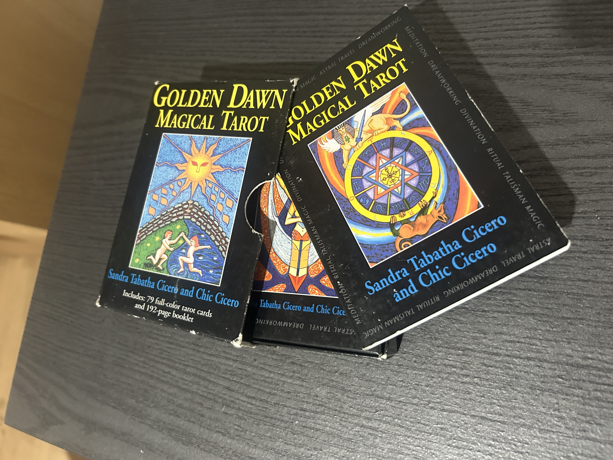

# Tarot Mágico de la Golden Dawn (Cicero)

## Principios de Funcionamiento

Este sistema opera a nivel de fuerzas arquetípicas y cosmológicas. Cada carta es a la vez una estación en el mapa cabalístico de la realidad, un acontecimiento astrológico, una fuerza adivinatoria y un objeto de meditación. Para leer la baraja con soltura, hay que tener en cuenta todas las capas a la vez sin que se confundan entre sí.

La baraja Cicero (*The New Golden Dawn Ritual Tarot*, 1991, Llewellyn) fue creada a petición directa de Israel Regardie, quien quería una baraja que cumpliera tanto los requisitos adivinatorios como los rituales del sistema GD. Es la primera baraja en emplear sistemáticamente las Escalas de Colores Cabalísticas y los colores intermitentes. Sus imágenes se han extraído del Libro T —el documento original de la GD sobre el Tarot atribuido a S.L. MacGregor Mathers, c. 1888.

Cada carta del sistema es a la vez: una correspondencia cabalística (Sefirá o Sendero en el Árbol de la Vida), una correspondencia astrológica (planeta, signo o elemento), una fuerza adivinatoria y un objeto de meditación. Para leer esta baraja con soltura, hay que tener en cuenta todas las capas a la vez sin que se mezclen entre sí.

La baraja contiene 79 cartas: las 78 estándar, más una segunda versión de La Templanza requerida por la práctica ritual de la GD.

En este sistema no se usan las cartas invertidas. Las dignidades elementales tienen el peso modificador — ver la sección Dignidades más abajo.

------------------------------------------------------------------------

## El Mapa Estructural

| Grupo                 | Cartas                                   | Atribución Cabalística                                |
|:----------------------|:-----------------------------------------|:------------------------------------------------------|
| Arcanos Mayores       | 0–XXI                                    | Los 22 Caminos del Árbol de la Vida                   |
| 4 Ases                | —                                        | Kether de cada palo (por encima del Árbol)            |
| 16 Cartas de la Corte | Rey, Reina, Príncipe, Princesa × 4 palos | Letras de YHVH × 4 elementos                          |
| 36 Cartas Numéricas   | 2–10 × 4 palos                           | Sephiroth 2–10 × 4 elementos; 36 Decanatos Zodiacales |

Los Ases no se encuentran en el Árbol propiamente dicho: son la fuerza radical y no diferenciada de cada elemento, situada en el Polo Norte del universo. Los Arcanos Mayores trazan los Caminos entre las Sefirot. Los Arcanos Menores describen las propias Sefirot actuando a través de cada mundo elemental.

------------------------------------------------------------------------

## Los Palos y Sus Correspondencias

**Bastos — Fuego — Atziluth (el Mundo Arquetípico)** El palo de la voluntad, la ambición, la iniciativa y la fuerza espiritual. Energía creativa pura antes de que haya encontrado una forma. La letra Yod del Tetragrammaton. Sagrado para el elemento Fuego. En la cosmología cabalística, el mundo más elevado y etéreo: el mundo de la divinidad pura. En la adivinación: vitalidad, iniciativa, valor, conflicto, empresa. El palo de lo que se está creando mediante la voluntad.

**Copas — Agua — Briah (el Mundo Creativo)** El palo de la emoción, la imaginación, el inconsciente, las relaciones y la fuerza receptiva y fértil. La letra Heh del Tetragrammaton. Sagrada para el Agua. Briah es el mundo de la inteligencia arcangélica —donde la voluntad divina se convierte en impulso creativo—. En la adivinación: amor, sentimiento, visión, la vida interior, cosas percibidas más que deseadas.

**Espadas — Aire — Yetzirah (el Mundo Formativo)** El palo del intelecto, el conflicto, el análisis, el lenguaje y la naturaleza ambivalente del pensamiento. La letra Vau del Tetragrammaton. Sagrada al Aire. Yetzirah es el mundo angelical —el mundo de la formación, donde los patrones toman forma antes de manifestarse—. En la adivinación: mente, lucha, comunicación, verdad y las consecuencias del pensamiento. El palo más peligroso de la baraja: la inteligencia sin sabiduría hiere.

**Pentáculos — Tierra — Assiah (el Mundo Material)** El palo de la manifestación, el plano físico, el cuerpo, el dinero, el trabajo y el resultado tangible de toda la actividad de los mundos superiores. La letra Heh final del Tetragrammaton. Sagrada para la Tierra. Assiah es el mundo material, la expresión más externa de la fuerza divina. En la adivinación: materia, salud, finanzas, asuntos prácticos y el cuerpo físico. Los Pentáculos no son ni afortunados ni desafortunados por naturaleza: describen lo que realmente se ha manifestado.

------------------------------------------------------------------------

## El Marco Cabalístico

### Las Sefirot y los Arcanos Menores

Las cartas numéricas del 2 al 10 corresponden a nueve de las diez Sefirot. Kether (1) es el As: se sitúa por encima de la secuencia como fuerza raíz radical. El número te indica qué cualidad de la Sefirá está activa en ese mundo elemental.

| Número | Sefirá    | Carácter                                                                                                |
|:-------|:----------|:--------------------------------------------------------------------------------------------------------|
| As     | Kether    | Corona; fuerza radical e indivisa; la esencia pura del palo                                             |
| 2      | Chokmah   | Sabiduría; polaridad iniciática; el Rey y la Reina que acaban de unirse; comienzos                      |
| 3      | Binah     | Comprensión; producción del Príncipe; la primera forma concreta; realización a través de la restricción |
| 4      | Chesed    | Misericordia; producción de la Princesa; la materia fijada y asentada; fundamentos                      |
| 5      | Geburah   | Severidad; lucha; perturbación del orden establecido; separación                                        |
| 6      | Tiphareth | Belleza; logro definitivo; el Sol del sistema; éxito y armonía                                          |
| 7      | Netzach   | Victoria; una fuerza que trasciende el plano material; el resultado depende de la acción tomada         |
| 8      | Hod       | Esplendor; fuerza dirigida con rapidez; gran poder ejecutivo; demasiado precipitado                     |
| 9      | Yesod     | Fundamento; fuerza fundamental; solidez; fuerza; la aproximación de la completitud                      |
| 10     | Malkuth   | Reino; fuerza fija y culminada; el asunto completamente determinado; resultado final                    |

### YHVH y las Cartas de la Corte

Las cuatro cartas de la corte llevan las cuatro letras del nombre divino, en orden:

| Rango    | Letra         | Elemento        | Cualidad                                                                                                    | Imagen en el Libro T                      |
|:---------|:--------------|:----------------|:------------------------------------------------------------------------------------------------------------|:------------------------------------------|
| Rey      | Yod (י)       | Fuego del palo  | Veloz, violento, iniciador; el efecto pasa rápidamente                                                      | Figura acorazada a caballo                |
| Reina    | Heh (ה)       | Agua del palo   | Reflexiva, receptiva; a la vez veloz y duradera; el trono de la fuerza                                      | Figura acorazada en trono                 |
| Príncipe | Vau (ו)       | Aire del palo   | Hijo del Rey y la Reina; rápido y duradero; el poder es vano si no es puesto en marcha por los progenitores | Figura acorazada en carro                 |
| Princesa | Heh final (ה) | Tierra del palo | Hija del Rey y la Reina; combina los tres; violenta y permanente en la materia                              | Figura de pie, amazona, con poca armadura |

------------------------------------------------------------------------

## Los Arcanos Mayores

Las 22 Claves son los 22 Caminos del Árbol de la Vida —los canales de fuerza que conectan las diez Sefirot. Cada camino es la energía viva que se mueve entre dos esferas específicas. Cada Camino tiene una letra hebrea, una atribución astrológica y un significado adivinatorio específico derivado de la interacción de los dos Sephiroth que une.

Los títulos de la Golden Dawn son los nombres que Mathers asignó en los grados de iniciación. No es necesario memorizarlos, pero ofrecen un segundo ángulo de lectura: describen la función arquetípica en lugar de las imágenes superficiales de la carta.

| Clave | Nombre                 | Letra Hebrea | Significado  | Atribución  | Camino                 | Título GD                                                            |
|:------|:-----------------------|:-------------|:-------------|:------------|:-----------------------|:---------------------------------------------------------------------|
|       | El Loco                | Aleph        | Buey         | Aire        | 11 (Kether–Chokmah)    | Espíritu del Éter                                                    |
| I     | El Mago                | Beth         | Casa         | Mercurio    | 12 (Kether–Binah)      | Mago del Poder                                                       |
| II    | La Gran Sacerdotisa    | Gimel        | Camello      | Luna        | 13 (Kether–Tiphareth)  | Sacerdotisa de la Estrella de Plata                                  |
| III   | La Emperatriz          | Daleth       | Puerta       | Venus       | 14 (Chokmah–Binah)     | Hija de los Poderosos                                                |
| IV    | El Emperador           | Heh          | Ventana      | Aries       | 15 (Chokmah–Tiphareth) | Hijo de la Mañana, Primero entre los Poderosos                       |
| V     | El Hierofante          | Vau          | Clavo        | Tauro       | 16 (Chokmah–Chesed)    | Mago de lo Eterno                                                    |
| VI    | Los Enamorados         | Zayin        | Espada       | Géminis     | 17 (Binah–Tiphareth)   | Hijos de la Voz: Oráculo de los Dioses Poderosos                     |
| VII   | El Carro               | Cheth        | Valla        | Cáncer      | 18 (Binah–Geburah)     | Hijo de los Poderes de las Aguas: Señor del Triunfo de la Luz        |
| VIII  | La Fuerza              | Teth         | Serpiente    | Leo         | 19 (Chesed–Geburah)    | Hija de la Espada Llameante                                          |
| IX    | El Ermitaño            | Yod          | Mano         | Virgo       | 20 (Chesed–Tiphareth)  | Profeta de lo Eterno: Mago de la Voz del Poder                       |
| X     | La Rueda de la Fortuna | Kaph         | Mano Cerrada | Júpiter     | 21 (Chesed–Netzach)    | Señor de las Fuerzas de la Vida                                      |
| XI    | La Justicia            | Lamed        | Aguijada     | Libra       | 22 (Geburah–Tiphareth) | Hija de los Señores de la Verdad: Soberana del Equilibrio            |
| XII   | El Colgado             | Mem          | Agua         | Agua        | 23 (Geburah–Hod)       | Espíritu de las Aguas Poderosas                                      |
| XIII  | La Muerte              | Nun          | Pez          | Escorpio    | 24 (Tiphareth–Netzach) | Hijo de los Grandes Transformadores: Señor de la Puerta de la Muerte |
| XIV   | La Templanza           | Samekh       | Puntal       | Sagitario   | 25 (Tiphareth–Yesod)   | Hija de los Reconciliadores: Portadora de la Vida                    |
| XV    | El Diablo              | Ayin         | Ojo          | Capricornio | 26 (Tiphareth–Hod)     | Señor de las Puertas de la Materia: Hijo de las Fuerzas del Tiempo   |
| XVI   | La Torre               | Peh          | Boca         | Marte       | 27 (Netzach–Hod)       | Señor de las Huestes de los Poderosos                                |
| XVII  | La Estrella            | Tzaddi       | Anzuelo      | Acuario     | 28 (Netzach–Yesod)     | Hija del Firmamento: Moradora entre las Aguas                        |
| XVIII | La Luna                | Qoph         | Nuca         | Piscis      | 29 (Netzach–Malkuth)   | Soberana del Flujo y el Reflujo: Hija de los Hijos de los Poderosos  |
| XIX   | El Sol                 | Resh         | Cabeza       | Sol         | 30 (Hod–Yesod)         | Señor del Fuego del Mundo                                            |
| XX    | El Juicio              | Shin         | Diente       | Fuego       | 31 (Hod–Malkuth)       | Espíritu del Fuego Primordial                                        |
| XXI   | El Universo            | Tau          | Cruz         | Saturno     | 32 (Yesod–Malkuth)     | El Grande de la Noche del Tiempo                                     |

### Significados Adivinatorios de los Arcanos Mayores

Breves significados adivinatorios, basados en el Libro T. En el sistema GD, la cuestión siempre es una de dignidad: una carta rodeada de cartas armoniosas expresa su fuerza positiva; en compañía adversa expresa su fuerza negativa. Se ofrecen ambos polos.

**0 — El Loco** Un salto hacia lo desconocido, pura potencialidad, visión espiritual desligada de las consecuencias materiales. La energía del Aire en su forma más etérea: puede ser trascendencia o locura, dependiendo totalmente de lo que la rodee. La única carta de la baraja sin un ancla sefirotica. Espíritu sin condiciones. *Mal dignificada:* Necedad, manía, imprudencia, espiritualidad poco práctica.

**I — El Mago** Habilidad, adaptabilidad, voluntad aplicada con precisión. El poder dirigido de Mercurio —el vínculo entre lo alto y lo bajo, la mente que puede trabajar en cualquier medio. Destreza, inteligencia al servicio de un propósito. *Mal dignificado:* Astucia, engaño, voluntad dirigida a la manipulación.

**II — La Gran Sacerdotisa** Cambio, fluctuación, el principio rítmico. El profundo conocimiento interior que precede al habla. Iniciación, sabiduría oculta, cosas aún no reveladas. La mente lunar. *Mal dignificada:* Vacilación, falta de fiabilidad, cambio sin dirección.

**III — La Emperatriz** Fertilidad, abundancia, belleza, placer, el principio creativo en plena expresión. La naturaleza haciendo lo que la naturaleza hace. Crecimiento, vida sensorial, actividad productiva. *Mal dignificada:* El lujo que se convierte en disipación, sensualidad sin discernimiento.

**IV — El Emperador** Conquista, gobierno, el establecimiento del orden a través de la voluntad y la fuerza. El fuego solar de Aries: iniciador, dominante, estructurador. Autoridad y la capacidad de construir sistemas. *Mal dignificado:* Dominación, rigidez, conquista sin sabiduría.

**V — El Hierofante** Enseñanza, iniciación, la transmisión del conocimiento sagrado. Sabiduría puesta al alcance de los demás. La sabiduría terrenal fija que abre puertas. Las instituciones en su mejor momento. *Mal dignificado:* Dogma, ceremonia sin sustancia, autoridad que impide en lugar de iniciar.

**VI — Los Enamorados** Intuición, clarividencia, la elección correcta hecha por inspiración en lugar de por cálculo. Unión, colaboración, la síntesis de opuestos en algo nuevo. *Mal dignificados:* Decisión inestable, tentación, elección tomada por razones equivocadas.

**VII — El Carro** Triunfo a través de la fuerza controlada. Victoria conseguida, pero solo si el consultante se esfuerza activamente. La voluntad que dirige fuerzas opuestas (las dos esfinges) hacia un único fin. El autodominio como vehículo del poder. *Mal dignificado:* Crueldad, victoria a través de la dominación en lugar del dominio.

**VIII — La Fuerza** Valor, resistencia, el poder de enfrentarse y domar lo feroz. Fuerza controlada que es paciente y compasiva en lugar de meramente agresiva. Magnanimidad. *Mal dignificada:* Abuso de poder, fuerza utilizada para aplastar en lugar de transformar.

**IX — El Ermitaño** Sabiduría buscada, encontrada y llevada con discreción. Iluminación desde arriba. Retirada con el propósito de alcanzar la meta. El maestro interior. El guía. *Mal dignificado:* Retirada excesiva, aislamiento por el simple hecho de aislarse, secretismo engreído.

**X — La Rueda de la Fortuna** El giro de los ciclos, la fortuna en movimiento, la llegada del cambio. La buena suerte de Júpiter —pero la fortuna no está en manos del consultante. Lo que tenga que girar, girará. *Mal dignificada:* Cambio a peor, ciclos que desgastan en lugar de elevar.

**XI — La Justicia** Equilibrio eterno. La verdad de la situación tal y como es, despojada de ilusiones. Lo que está equilibrado, está equilibrado; lo que está desequilibrado se corregirá. La espada de la discriminación. *Mal dignificada:* Desequilibrio, injusticia, juicio retenido.

**XII — El Colgado** Una suspensión necesaria, un sacrificio impuesto. El trabajo que no se puede apresurar. Rendirse a un proceso que no se puede controlar. A veces: una iniciación que exige el sacrificio de una identidad anterior. *Mal dignificado:* Martirio sin sentido, autocastigo, sacrificio en vano.

**XIII — La Muerte** Transformación, el fin de un ciclo como condición para otro. El tiempo, el cambio, el gran nivelador. No la muerte física como significado principal —la muerte de circunstancias, identidades, situaciones. *Mal dignificada:* Inercia, rechazo a la transformación, estancamiento.

**XIV — La Templanza** La combinación de fuerzas en una síntesis funcional. Alquimia —la interacción de elementos opuestos produce algo que ninguno de ellos contiene por sí solo. La moderación como un arte activo, no una restricción pasiva. La carta del proceso y la prueba. *Mal dignificada:* Discordia en la combinación, mezcla desafortunada.

**XV — El Diablo** La materialidad plenamente realizada. La fuerza vinculante del plano físico. Tentación, obsesión, el poder de la compulsión. Cuando está bien dignificado: intensa fuerza material puesta en acción. El Diablo no es malo —es el Señor de la Materia. *Mal dignificado:* Esclavitud, adicción, las fuerzas de la materia activamente destructivas.

**XVI — La Torre** Cambio catastrófico y repentino. La estructura que se construyó sobre cimientos falsos se derrumba. No se puede evitar una vez que se pone en marcha. A veces: liberación a través de la destrucción. *Mal dignificada:* Ruina, violencia, pérdida irrecuperable.

**XVII — La Estrella** Esperanza, ayuda inesperada, la gracia que llega cuando se necesita. La clara perspectiva cósmica restaurada tras la oscuridad de La Luna. Fe con base en la realidad. *Mal dignificada:* Esperanzas que no se cumplirán. Ilusiones confundidas con visión.

**XVIII — La Luna** Ilusión, terror, desconcierto, las fuerzas del subconsciente ejerciendo una presión peligrosa. Las cosas no son lo que parecen. Sueños con garras. El estado liminal entre mundos. *Mal dignificada:* Errores insignificantes, autoengaño, confusión menor en lugar de peligro grave.

**XIX — El Sol** Alegría, satisfacción, gran fortuna, claridad, el placer de estar plenamente presente en un mundo bueno. La carta más inequívocamente afortunada de los Arcanos Mayores. *Mal dignificado:* Como arriba, pero a menor escala —éxito menos total, felicidad menos completa.

**XX — El Juicio** Decisión final, la resolución de un asunto que lleva mucho tiempo pendiente. Se ha pasado el punto de no retorno. Culminación, ajuste de cuentas, el resultado que ahora se puede nombrar. *Mal dignificado:* Retraso en el juicio, consecuencias pospuestas.

**XXI — El Universo** El tema de la pregunta en sí mismo —el mundo tal y como está realmente. La gran síntesis. Esta carta suele describir la situación en la que se encuentra realmente el consultante, en lugar de añadirle fuerza. Su significado viene determinado casi por completo por lo que la rodea.

------------------------------------------------------------------------

## Los Ases

Los cuatro Ases no se colocan en el Árbol de la Vida. Se sitúan por encima de él, en el polo de su elemento: el poder primigenio e indiviso, antes de que se diferencie en los diez Sefirot. Trátalos como comienzos absolutos: no como iniciaciones suaves, sino como el primer golpe de fuerza, antes de que esa fuerza haya encontrado su forma.

**As de Bastos — Raíz de los Poderes del Fuego** Voluntad pura. Energía creativa en bruto, sin dirección, aún sin moldear por ningún objetivo ni consecuencia. En la adivinación: la fuerza de un nuevo comienzo que lleva consigo un calor y un potencial tremendos. Todo depende de lo que hagan con ella las cartas que la rodean.

**As de Copas — Raíz de los Poderes del Agua** Sentimiento puro. La fuente desbordante —la fuente de agua clara que da vida a todas las cartas de Copas que hay debajo. El amor como principio cósmico más que como emoción personal. El inconsciente profundo se hace accesible.

**As de Espadas — Raíz de los Poderes del Aire** La espada invocada. El intelecto puro como fuerza de doble filo: levantada hacia arriba, invoca la claridad divina; invertida, invoca el caos. El As de Espadas contiene tanto el poder de la liberación como el poder de la aflicción en igual medida. El As más volátil.

**As de Pentáculos — Raíz de los Poderes de la Tierra** La materialidad en todas sus formas, buenas y malas. La semilla de todo lo material: la riqueza, la salud, el cuerpo físico, la tierra misma. Ni afortunado ni desafortunado por sí mismo —muestra lo que se ha hecho posible en la materia.

------------------------------------------------------------------------

## Las Cartas de la Corte

Las cartas de la corte representan a personas relacionadas con el asunto, al propio consultante o a las fuerzas dominantes que determinan la situación. El Libro T especifica: *Los príncipes y las reinas representan casi siempre a hombres y mujeres reales. Los reyes indican llegadas y partidas repentinas. Las princesas muestran opiniones, pensamientos e ideas, ya sea en armonía con el tema o en oposición a él.*

### Reyes — Yod, Fuego del palo; veloces, iniciadores

**Rey de Bastos — Señor de la Llama y el Rayo: Rey de los Espíritus del Fuego** Fuego del Fuego. La persona más puramente ardiente de la baraja —rápida, generosa, intensa, noble e impetuosa. Rápida para actuar, rápida para olvidar. Un líder natural cuyo poder es genuino, pero cuyo efecto rara vez perdura más allá del momento de su intervención. Cuando esta persona se compromete plenamente, es extraordinario. Rara vez se compromete plenamente. *Región zodiacal: 21° Escorpio a 20° Sagitario.*

**Rey de Copas — Señor de las Olas y las Aguas: Rey de las Huestes del Mar** Fuego del Agua. La persona que aporta una intensa fuerza emocional —gracia, sutileza, sentimientos profundos, pero a veces violencia cuando se le presiona. Un maestro de la vida interior que también puede actuar con decisión. Puede ser reservado e indirecto; a menudo artístico. El fuego dentro del agua crea tanto belleza como, en ocasiones, explosividad. *Región zodiacal: 21° Acuario a 20° Piscis.*

**Rey de Espadas — Señor del Viento y las Brisas: Rey de los Espíritus del Aire** Fuego del Aire. La persona que inicia la fuerza intelectual —autoritaria, brillante, activa en actividades mentales, decisiva en su juicio. Capaz de gran autoridad y gran crueldad en igual proporción. La mente más aguda de la sala, y la más rápida en usarla como arma. *Región zodiacal: 21° Tauro a 20° Géminis.*

**Rey de Pentáculos — Señor de la Tierra Amplia y Fértil: Rey de los Espíritus de la Tierra** Fuego de la Tierra. La persona que inicia la fuerza material —trabajadora, competente, fiable, potencialmente lenta para cambiar. La energía de alguien que construye cosas y las mantiene en pie. No es emocionante. Exactamente lo que se necesita cuando están en juego los cimientos. *Región zodiacal: 21° Leo a 20° Virgo.*

### Reinas — Heh, Agua del palo; entronizadas, receptivas

**Reina de Bastos — Reina de los Tronos de la Llama** Agua de Fuego. El trono sobre el que descansa la fuerza ardiente y se vuelve útil: adaptable, perseverante, silenciosamente poderosa. Una persona de intensidad constante, menos explosiva que el Rey, pero mucho más resistente. Poder autónomo. Puede ser obstinada; sin duda, capaz. *Región zodiacal: 21° Piscis a 20° Aries.*

**Reina de Copas — Reina de los Tronos de las Aguas** Agua de Agua. La inteligencia emocional más profunda de la baraja —imaginativa, visionaria, psíquicamente sensible, la persona que sabe lo que sienten los demás antes de que lo digan. Puede ser médium, soñadora o estar perdida en las profundidades. La superficie de un espejo que muestra la verdad, pero que también puede distorsionarla. *Región zodiacal: 21° Géminis a 20° Cáncer.*

**Reina de Espadas — Reina de los Tronos del Aire** Agua del Aire. Percepción aguda e imparcial. Una persona que ha sufrido y, como resultado, ha aprendido a ver con claridad. La viuda, la mujer sola, la mente que ha perdido las ilusiones y es mejor así. Inteligencia aguda, autoridad tranquila, posible severidad. Verdad sin piedad. *Región zodiacal: 21° Virgo a 20° Libra.*

**Reina de Pentáculos — Reina de los Tronos de la Tierra** Agua de la Tierra. Inteligencia material: ingeniosa, generosa, creativa en los ámbitos prácticos, la persona que hace que las cosas sean bonitas y funcionales a la vez. Generosa, a veces en exceso. La capacidad de hacer fértil cualquier entorno. *Región zodiacal: 21° Sagitario a 20° Capricornio.*

### Príncipes — Vau, Aire del palo; en carro, en movimiento

**Príncipe de Bastos — Príncipe del Carro de Fuego** Aire de Fuego. Ideas sobre la voluntad —la dimensión intelectual de la fuerza ardiente. Enérgico, precipitado, fuerte, a veces violento, a menudo derrochador. Una persona llena de iniciativa pero con poca capacidad de seguimiento. Brillante en los comienzos. No se puede confiar en él para llevar las cosas a término.

**Príncipe de Copas — Príncipe del Carro de las Aguas** Aire de Agua. La persona que piensa en los sentimientos —sutil, artística, reflexiva, capaz de gran profundidad, pero a veces fría o distante tras la sensibilidad emocional. Una fuerza creativa que necesita motivación externa para manifestar sus dones.

**Príncipe de Espadas — Príncipe del Carro de los Vientos** Aire de Aire. La persona más puramente intelectual de la baraja. Inteligente, perspicaz, propensa al conflicto, excelente para ver problemas y crear otros nuevos. Habilidad sin rumbo —capaz de grandes cosas cuando se compromete de verdad, destructivo cuando se vuelve contra quienes le rodean.

**Príncipe de Pentáculos — Príncipe del Carro de la Tierra** Aire de la Tierra. Metódico, paciente, perseverante, trabajador. La persona que realmente terminará el proyecto y lo hará bien. Puede ser demasiado cauteloso o inflexible. Absolutamente fiable en lo material; a veces de visión limitada.

### Princesas — Heh final, Tierra del palo; de pie, amazonas

**Princesa de Bastos — Princesa de la Llama Brillante: Rosa del Palacio del Fuego** Tierra de Fuego —el trono del As de Bastos. Una idea o espíritu que arde con fuerza pero aún no se ha puesto en marcha. Gran entusiasmo que aún no ha encontrado su rumbo. Generosidad, valentía, belleza, ira repentina. La fuerza antes de montar a caballo.

**Princesa de Copas — Princesa de las Aguas: Loto del Palacio de las Inundaciones** Tierra de Agua —el trono del As de Copas. Tierna, imaginativa, amable, el impulso amoroso aún no disciplinado por la experiencia. Dones artísticos en fase incipiente. Puede ser impresionable, inconstante, excesivamente soñadora.

**Princesa de Espadas — Princesa de los Vientos Impetuosos: Loto del Palacio del Aire** Tierra de Aire —el trono del As de Espadas. Aguda, observadora, crítica, la mente joven que quiere atravesarlo todo. Ágil intelectualmente, pero no siempre sabe cuándo usar la espada. Puede ser disputadora por el simple hecho de disputar.

**Princesa de Pentáculos — Princesa de las Colinas Resonantes: Rosa del Palacio de la Tierra** Tierra de la Tierra —el trono del As de Pentáculos. La entidad más material de la baraja. Reflexiva, tranquila, meditada, generosa en el sentido práctico. Gran capacidad de aplicación una vez que se compromete. Propensa a la obstinación; no se deja convencer fácilmente.

------------------------------------------------------------------------

## Los Arcanos Menores: Cartas Numéricas 2–10

Cada carta numérica tiene tres atribuciones simultáneas:

1.  **Sefirá** (según el número — ver Marco más arriba)

2.  **Elemento del palo** (según el palo)

3.  **Decanato Zodiacal** (planeta en signo — la energía específica activa en esa Sefirá)

El título del Libro T es el nombre exacto de la fuerza: memorízalos. Son más útiles en la práctica que cualquier descripción elaborada.

### Bastos (Fuego) — para los tres signos de Fuego: Aries, Leo, Sagitario

| Carta        | Título del Libro T             | Decanato              | Fuerza Adivinatoria                                                                                                                    |
|:-------------|:-------------------------------|:----------------------|:---------------------------------------------------------------------------------------------------------------------------------------|
| de Bastos    | Señor del Dominio              | Marte en Aries        | Voluntad plenamente realizada; influencia sobre los demás; un poder recién consolidado. Orgullo en la autoridad.                       |
| 3 de Bastos  | Señor de la Fuerza Establecida | Sol en Aries          | El primer resultado de la voluntad: cosas construidas y que se mantienen. Empresa confirmada.                                          |
| 4 de Bastos  | Señor de la Obra Perfecta      | Venus en Aries        | Finalización; una tarea bien hecha; el descanso que sigue al esfuerzo genuino. Estabilización.                                         |
| 5 de Bastos  | Señor de la Lucha              | Saturno en Leo        | Conflicto, competencia, lucha por el dominio. No es una catástrofe: la fricción de voluntades opuestas.                                |
| 6 de Bastos  | Señor de la Victoria           | Júpiter en Leo        | Éxito ganado a través del conflicto. El fuego ha prevalecido. Reconocimiento.                                                          |
| 7 de Bastos  | Señor del Valor                | Marte en Leo          | Una posición mantenida frente a la oposición. Se requiere valor; el resultado es incierto, pero el valor está ahí.                     |
| 8 de Bastos  | Señor de la Celeridad          | Mercurio en Sagitario | Movimiento rápido, cosas volando hacia su objetivo. Velocidad, comunicación, cosas que llegan.                                         |
| 9 de Bastos  | Señor de la Gran Fuerza        | Luna en Sagitario     | Enormes reservas de fuerza; tenacidad; la capacidad de resistir. Preparación.                                                          |
| 10 de Bastos | Señor de la Opresión           | Saturno en Sagitario  | Sobrecarga, la fuerza se vuelve contra sí misma, el fuego se convierte en un peso excesivo. Energía gastada en el objetivo equivocado. |

### Copas (Agua) — para los tres signos de Agua: Cáncer, Escorpio, Piscis

| Carta       | Título del Libro T               | Decanato           | Fuerza Adivinatoria                                                                                                     |
|:------------|:---------------------------------|:-------------------|:------------------------------------------------------------------------------------------------------------------------|
| de Copas    | Señor del Amor                   | Venus en Cáncer    | El comienzo del amor; dos naturalezas emocionales que se encuentran y se reconocen mutuamente. Atracción, afinidad.     |
| 3 de Copas  | Señor de la Abundancia           | Mercurio en Cáncer | Pleno emocional; la abundancia que surge de una conexión amorosa; celebración, amistad, alegría.                        |
| 4 de Copas  | Señor del Placer Mezclado        | Luna en Cáncer     | Placer mezclado con algo más: saciedad, o reflexión, o un ligero descontento en medio de la comodidad.                  |
| 5 de Copas  | Señor de la Pérdida en el Placer | Marte en Escorpio  | Algo querido se ha ido o se ha estropeado. No es una catástrofe: una pérdida en un ámbito emocional que antes era rico. |
| 6 de Copas  | Señor del Placer                 | Sol en Escorpio    | Placer recuperado; el pasado ofreciendo sus regalos; generosidad, recuerdo, la dulzura de lo que fue.                   |
| 7 de Copas  | Señor del Éxito Ilusorio         | Venus en Escorpio  | Visiones atractivas sin sustancia detrás; fantasía, ilusiones, hermosa confusión.                                       |
| 8 de Copas  | Señor del Éxito Abandonado       | Saturno en Piscis  | Retirada de lo que funcionaba; el alejarse deliberadamente de un camino que ya no satisface.                            |
| 9 de Copas  | Señor de la Felicidad Material   | Júpiter en Piscis  | Satisfacción de los deseos; el deseo hecho realidad; contentamiento. La Copa más afortunada.                            |
| 10 de Copas | Señor del Éxito Perfecto         | Marte en Piscis    | Plenitud emocional; felicidad duradera; el ciclo de los sentimientos llevado a su máxima expresión.                     |

### Espadas (Aire) — para los tres signos de Aire: Libra, Acuario, Géminis

| Carta         | Título del Libro T                      | Decanato            | Fuerza Adivinatoria                                                                                                                              |
|:--------------|:----------------------------------------|:--------------------|:-------------------------------------------------------------------------------------------------------------------------------------------------|
| de Espadas    | Señor de la Paz Restaurada              | Luna en Libra       | Tensión mantenida en equilibrio; la paz lograda por la disciplina más que por la resolución. Una tregua, no una reconciliación.                  |
| 3 de Espadas  | Señor de la Tristeza                    | Saturno en Libra    | Pena, dolor, tristeza. La mente registra una pérdida real. No se puede negar.                                                                    |
| 4 de Espadas  | Señor del Reposo tras la Lucha          | Júpiter en Libra    | Recuperación; tregua tras la batalla; la mente descansa tras el conflicto. Retirada necesaria.                                                   |
| 5 de Espadas  | Señor de la Derrota                     | Venus en Acuario    | Pérdida, conquista por parte de otro, fracaso de un plan. La inteligencia utilizada en su contra.                                                |
| 6 de Espadas  | Señor del Éxito Ganado                  | Mercurio en Acuario | Avance hacia aguas más tranquilas; paso ganado tras las dificultades; mejora gradual y deliberada.                                               |
| 7 de Espadas  | Señor del Esfuerzo Inestable            | Luna en Acuario     | Planes a medio hacer; esfuerzo que carece de fundamento; la mente socavándose a sí misma. Astucia o evasión.                                     |
| 8 de Espadas  | Señor de la Fuerza Acortada             | Júpiter en Géminis  | Interferencia; restricción; una fuerza que no puede alcanzar su objetivo. Esclavitud, no desde fuera, sino desde la propia mente.                |
| 9 de Espadas  | Señor de la Desesperación y la Crueldad | Marte en Géminis    | El punto más oscuro de la experiencia mental. Desesperación, crueldad —ya sea sufrida o ejercida—. La pesadilla.                                 |
| 10 de Espadas | Señor de la Ruina                       | Sol en Géminis      | El colapso total de una estructura mental o material. Fin absoluto, lo peor ya ha pasado. Lo que viene después hay que reconstruirlo desde cero. |

### Pentáculos (Tierra) — para los tres signos de Tierra: Capricornio, Tauro, Virgo

| Carta            | Título del Libro T                   | Decanato               | Fuerza Adivinatoria                                                                                                        |
|:-----------------|:-------------------------------------|:-----------------------|:---------------------------------------------------------------------------------------------------------------------------|
| de Pentáculos    | Señor del Cambio Armonioso           | Júpiter en Capricornio | Fluctuación en las circunstancias materiales; la capacidad de equilibrar múltiples presiones sin agobiarse.                |
| 3 de Pentáculos  | Señor de las Obras Materiales        | Marte en Capricornio   | Trabajo iniciado y en progreso; habilidad práctica aplicada; cosas en construcción. El artesano en el trabajo.             |
| 4 de Pentáculos  | Señor del Poder Terrenal             | Sol en Capricornio     | Poder material consolidado; control sobre los recursos; la tendencia a aferrarse demasiado a lo que se tiene.              |
| 5 de Pentáculos  | Señor de las Dificultades Materiales | Mercurio en Tauro      | Pobreza, preocupación, dificultades materiales. Las cosas no funcionan en el ámbito físico. Pérdida de lo que te sustenta. |
| 6 de Pentáculos  | Señor del Éxito Material             | Luna en Tauro          | Éxito material; generosidad; el flujo adecuado de recursos entre quienes tienen y quienes necesitan.                       |
| 7 de Pentáculos  | Señor del Éxito Incumplido           | Saturno en Tauro       | Trabajo realizado, pero recompensa retenida o incierta; esfuerzo sin un resultado claro; a la espera de la cosecha.        |
| 8 de Pentáculos  | Señor de la Prudencia                | Sol en Virgo           | Trabajo cualificado; dominio del oficio; la aplicación cuidadosa de la inteligencia a las tareas materiales.               |
| 9 de Pentáculos  | Señor de la Ganancia Material        | Venus en Virgo         | Abundancia gracias al propio trabajo; satisfacción material; la vida cómoda ganada.                                        |
| 10 de Pentáculos | Señor de la Riqueza                  | Mercurio en Virgo      | Riqueza completa; la culminación del esfuerzo material a lo largo de generaciones; prosperidad consolidada.                |

------------------------------------------------------------------------

## Dignidades Elementales

En el sistema GD, las inversiones se sustituyen por dignidades. Las cartas que rodean a la carta en cuestión la refuerzan o la debilitan, según la armonía o el antagonismo entre los elementos.

**Relaciones elementales:**

|            | Fuego    | Agua     | Aire     | Tierra   |
|:-----------|:---------|:---------|:---------|:---------|
| **Fuego**  | Muy afín | Hostil   | Afín     | Hostil   |
| **Agua**   | Hostil   | Muy afín | Hostil   | Afín     |
| **Aire**   | Afín     | Hostil   | Muy afín | Hostil   |
| **Tierra** | Hostil   | Afín     | Hostil   | Muy afín |

**Reglas:**

- El Fuego y el Aire son amigos entre sí (ambos activos)

- El Agua y la Tierra son amigas entre sí (ambas pasivas)

- El Fuego y el Agua son enemigos entre sí

- El Aire y la Tierra son enemigos entre sí

- Una carta flanqueada por dos cartas de un elemento amigo alcanza su máxima fuerza

- Una carta flanqueada por dos cartas hostiles se debilita o su efecto se invierte

- Una carta flanqueada por una carta amiga y otra hostil es neutra; lee el significado literal de la carta

Los Arcanos Mayores tienen atribuciones elementales (El Loco = Aire, El Colgado = Agua, El Juicio = Fuego, El Universo = Tierra, y el resto lleva su elemento astrológico). Aplica la misma lógica de dignidades.

------------------------------------------------------------------------

## Características Específicas de la Baraja Cicero

**Colores intermitentes.** Cada carta está pintada con pares de colores complementarios (opuestos en la rueda de colores). Una mirada fija produce un destello visual o una alternancia entre los dos colores. Se trata de una técnica autohipnótica intencionada: el destello desestabiliza el procesamiento visual habitual y abre el estado meditativo. Los Cicero describen esto como parte de la función mágica de la carta, no solo de su estética.

**Las Escalas de Color.** La baraja aplica las cuatro Escalas de Color Cabalísticas correspondientes a los cuatro Mundos: Escala del Rey (Atziluth/Bastos), Escala de la Reina (Briah/Copas), Escala del Príncipe (Yetzirah/Espadas), Escala de la Princesa (Assiah/Pentáculos). Los fondos de las cartas numéricas utilizan el color zodiacal apropiado a la escala mundial del palo. Esto se aprecia al observarlas de cerca y cambia significativamente la cualidad meditativa de cada carta.

**Dos cartas de La Templanza.** El ritual de iniciación de Neófito de la GD requiere una orientación de la figura de La Templanza; el ritual de Adeptus Minor requiere otra. Ambas están incluidas en la baraja de 79 cartas. Para la adivinación, usá cualquiera de las dos: tienen la misma fuerza adivinatoria.

**Símbolos astrológicos y decanales en las cartas numéricas.** Cada carta numérica del 2 al 10 muestra su signo astrológico y su regente planetario como símbolos visuales, situados en la parte superior de la carta. La baraja Cicero hace que estas atribuciones sean legibles sin necesidad de consultar referencias externas: el sistema está, literalmente, escrito en las cartas.

------------------------------------------------------------------------

## Armonía y Antagonismo entre Palos

Un resumen práctico para la lectura de tiradas:

**Bastos y Copas juntos:** Tensión, conflicto; el fuego y el agua tirando en direcciones opuestas. Puede que aún así se consiga un resultado, pero a un precio.

**Bastos y Espadas juntos:** Refuerzo mutuo —ambos son elementos activos—. Acción rápida, agresividad intelectual, movimiento decisivo. Puede resultar imprudente.

**Bastos y Pentáculos juntos:** Tensión —la voluntad creativa ardiente se enfrenta a la resistencia material—. Puede frustrar o dar estabilidad, dependiendo de cuál domine.

**Copas y Pentáculos juntos:** Apoyo mutuo —ambos pasivos, receptivos—. El bienestar emocional y material se alinean. Generalmente favorable.

**Copas y Espadas juntos:** Tensión profunda —el mundo de los sentimientos y el mundo del pensamiento en desacuerdo—. Conflicto interno, la cabeza y el corazón en oposición.

**Espadas y Pentáculos juntos:** Tensión —los planos intelectual y material se resisten mutuamente—. La practicidad se ve frustrada por pensar demasiado, o por ideas que no encuentran una base material.

Cuando una tirada está dominada por un solo palo, interpretá el ámbito de ese palo como el campo de acción central de la pregunta —aunque la pregunta trate nominalmente de otra cosa. Las cartas suelen saber cuál es la pregunta real mejor que el consultante.

------------------------------------------------------------------------

## Tiradas

### Carta Única

¿Cuál es la fuerza que opera en esta situación? Sacá una carta para el carácter esencial del momento presente.

### Tres Cartas

**Pasado — Presente — Futuro** (arco temporal) o: **Arriba — Abajo — Entre** (lo que aspira / lo que fundamenta / lo que opera en el punto de cruce) o: **Tesis — Antítesis — Síntesis** (para preguntas sobre fuerzas opuestas)

### La Cruz Celta (Diez Cartas)

El método GD preferido para preguntas complejas:

1.  El asunto en sí (centro)

2.  Lo que lo atraviesa (el obstáculo o la segunda fuerza)

3.  El ideal o la aspiración de arriba

4.  La base, el hecho oculto

5.  Lo que se está desvaneciendo

6.  Lo que se aproxima

7.  La posición actual del consultante

8.  El entorno y las influencias externas

9.  Las esperanzas y los temores

10. El resultado

### La Apertura de la Llave (Cinco Operaciones)

El método adivinatorio completo de GD del Libro T, usado para consultas serias. Requiere una sesión de lectura completa. Implica cinco operaciones sucesivas, cada una usando las 78 cartas, reduciendo progresivamente la pregunta desde el cosmos hasta lo específico. Este método se describe completo en el libro complementario de los Cicero, *The New Golden Dawn Ritual Tarot*.

### La Tirada de Quince Cartas (Cicero)

Una tirada para preguntas complejas que presenta dos posibles caminos hacia adelante. Documentada en el material complementario de la baraja Cicero. Se disponen quince cartas en cinco filas de tres, numeradas en espiral desde el centro hacia afuera en sentido antihorario:

Las cartas se leen en cinco trinidades. La carta central de cada trinidad es la principal; las cartas flanqueantes son sus modificadoras, ponderadas por dignidad elemental. No se usan inversiones.

- **Cartas 1, 2, 3 — El Consultante:** La carta 1 es el núcleo de la tirada: el consultante, la naturaleza de la pregunta y las principales influencias operativas. Las cartas 2 y 3 amplían la lectura de la carta 1, describiendo las circunstancias que la rodean y la naturaleza propia del consultante en relación con el asunto.

- **Cartas 4, 8, 12 — Camino Actual:** El curso natural de los eventos tal como se desarrollarían sin intervención. Se leen cronológicamente de izquierda a derecha.

- **Cartas 13, 9, 5 — Camino Alternativo:** Un curso de acción alternativo disponible para el consultante. Se leen de izquierda a derecha (13 → 9 → 5). Si estas cartas se leen como continuación más que como divergencia del camino actual, tratarlas como su extensión: 4–8–12–13–9–5 en secuencia.

- **Cartas 6, 10, 14 — Base Psicológica:** El fundamento psicológico e implicaciones de la situación; la dimensión interior de la pregunta.

- **Cartas 7, 11, 15 — Karma:** Fuerzas que operan más allá del control del consultante. No han de resistirse, sino comprenderse y adaptarse a ellas.

------------------------------------------------------------------------

## Notas sobre Combinaciones

Ciertos pares tienen un significado que supera la suma de sus cartas individuales. Estos se acumulan con el uso. Puntos de partida:

- **La Torre cerca de la Rueda de la Fortuna**: inversión repentina de la fortuna existente, cambio ni buscado ni elegido

- **La Gran Sacerdotisa cerca de cualquier carta de la corte**: la persona no está mostrando su naturaleza completa; existe una dimensión oculta

- **La Muerte cerca del Diez de Pentáculos**: la transformación de las circunstancias materiales al nivel más fundamental —herencia, pérdida de patrimonio, el paso de una era

- **El 9 de Copas cerca del Sol**: el deseo concedido en su totalidad; una de las combinaciones más afortunadas de la baraja

- **El 9 de Espadas cerca de La Luna**: la pesadilla que también es una advertencia real, no un simple miedo; algo que hay que afrontar en lugar de interpretar

- **3 cartas de Espadas en una sola lectura**: el dominio del conflicto intelectual y el dolor es dominante —no lo ignorés, independientemente de los otros palos que aparezcan

- **Múltiples cartas de la corte de diferentes palos**: múltiples personas están significativamente involucradas y sus naturalezas elementales armonizarán o entrarán en conflicto

Registrá las combinaciones que resulten efectivas en tus propias lecturas y añadílas aquí.

------------------------------------------------------------------------

## Sobre las Inversiones

No se usan en este sistema. Las dignidades elementales tienen el peso modificador. Una carta rodeada de elementos hostiles muestra su cara más difícil; rodeada de elementos armoniosos, la más favorable. Una carta de Espadas sola en una lectura llena de Copas se lee de forma diferente a la misma carta de Espadas rodeada de otras Espadas. Dejá que las relaciones entre las cartas hagan el trabajo interpretativo que las inversiones intentan hacer a través de la posición.
