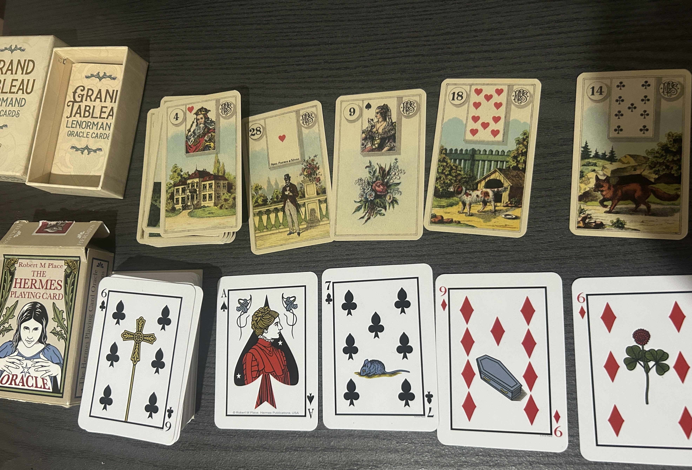

# Oráculo Lenormand

## Principios de Funcionamiento

Este sistema opera a nivel de las circunstancias: qué está pasando, a quién le pasa, en qué ámbito y en qué relación con todo lo demás. Interpreta el mundo material con precisión y sin sentimentalismos. Donde el sistema de naipes inglés lee cartas individuales en tiradas con posiciones definidas, este sistema lee cadenas de cartas a lo largo de un campo. La unidad de significado no es la carta, sino la combinación. Una sola carta te da un sustantivo. Dos cartas te dan una oración. El cuadro completo te da un mapa.

El sistema de naipes inglés es un instrumento complementario natural. Ambos leen el registro circunstancial. Ninguno usa inversiones. Ambos comparten el mismo sustrato de naipes. Donde más difieren es en el método: el sistema inglés ocupa posiciones definidas; el Lenormand lee las relaciones espaciales a lo largo de un campo abierto. Los significados de los naipes individuales a menudo entran en conflicto entre los dos sistemas —esos conflictos se documentan a lo largo de este texto donde tienen importancia práctica.

Sin inversiones. Sin profundidad arquetípica. Sin marco cosmológico. La autoridad de este sistema es totalmente pragmática: siglos de uso constante que producen resultados constantes.

------------------------------------------------------------------------

## La Estructura

La baraja estándar de Lenormand contiene 36 cartas. Cada carta lleva una imagen simbólica y un naipe insertado. Los naipes insertados son vestigios del origen del sistema como el Juego de la Esperanza alemán (1799) —un juego de carreras que más tarde fue reutilizado para la adivinación. Las inserciones no son decorativas; en la tradición original tenían un significado adicional. La práctica moderna varía: algunos lectores usan ambas capas, la mayoría trata la imagen como principal.

Las 36 cartas se dividen vagamente en ámbitos temáticos, pero no están agrupadas formalmente. Las 36 cartas están activas en cada lectura. La baraja no tiene distinción Mayor/Menor, clase de cartas de la corte, ni lógica elemental basada en palos de la forma en que lo hace la cartomancia con naipes. La identidad del palo en el naipe insertado es en gran medida inerte: la imagen gobierna.

------------------------------------------------------------------------

## Los Significadores

Dos cartas representan a personas como su función principal: el Hombre (carta 28, tradicionalmente As de Corazones) y la Mujer (carta 29, tradicionalmente As de Picas). Todo en el Grand Tableau se interpreta en relación con sus posiciones.

En el Lenormand tradicional, el significador se localiza primero y toda la lectura irradia hacia afuera desde ese ancla. Las cartas más cercanas al significador son las más inmediatas; las más lejanas son las más distantes en el tiempo o en relevancia.

El significador no lleva significado adivinatorio mientras funciona como ancla de referencia del sujeto. Es un localizador.

------------------------------------------------------------------------

## Las 36 Cartas

Los significados siguen la tradición moderna, con preferencia por el enfoque interpretativo de Place donde está documentado. Donde el naipe insertado entra en conflicto significativo con el sistema de naipes inglés, esto se hace constar.

| \#  | Imagen        | Naipe | Significado Central                                                                        |
|:----|:--------------|:------|:-------------------------------------------------------------------------------------------|
|     | El Jinete     | 9♥    | Noticias que llegan; un mensajero; algo que se aproxima rápidamente; innovación            |
| 2   | El Trébol     | 6♦    | Buena suerte breve; una pequeña oportunidad afortunada; oportunidad fugaz                  |
| 3   | El Barco      | 10♠   | Viaje; un trayecto; comercio; asuntos extranjeros; distancia; anhelo; riesgo               |
| 4   | La Casa       | K♥    | Hogar; familia; seguridad; el ámbito doméstico; un dominio acotado                         |
| 5   | El Árbol      | 7♥    | Salud; vitalidad; crecimiento lento; raíces profundas; patrones ancestrales; plazos largos |
| 6   | Las Nubes     | K♣    | Confusión; incertidumbre; verdad oscurecida; lo que no se puede ver con claridad           |
| 7   | La Serpiente  | Q♣    | Complicación; engaño; peligro; un camino sinuoso; una mujer difícil                        |
| 8   | El Ataúd      | 9♦    | Final; finalización de un ciclo; transformación a través del cese; enfermedad              |
| 9   | El Ramo       | Q♠    | Un regalo; belleza; una invitación; felicidad; dones creativos; apreciación                |
| 10  | La Guadaña    | J♦    | Peligro repentino; un corte decisivo; la cosecha; advertencia; separación rápida           |
| 11  | El Látigo     | J♣    | Conflicto; repetición; discusión; esfuerzo físico; vaivén                                  |
| 12  | Los Pájaros   | 7♦    | Conversación; charla; nerviosismo; una pareja; preocupación; comunicación                  |
| 13  | El Niño       | J♠    | Algo nuevo y pequeño; un comienzo; ingenuidad; etapas tempranas; inocencia                 |
| 14  | El Zorro      | 9♣    | Autopreservación; astucia; alerta; engaño cercano; trabajo y carrera                       |
| 15  | El Oso        | 10♣   | Fuerza; autoridad; una persona poderosa; finanzas; protección; dominio                     |
| 16  | Las Estrellas | 6♥    | Deseos; guía; orientación espiritual; esperanza arraigada en la realidad; claridad         |
| 17  | La Cigüeña    | Q♥    | Cambio; movimiento; mejora; transformación positiva; nueva llegada                         |
| 18  | El Perro      | 10♥   | Amistad; lealtad; una persona conocida y de confianza; apoyo fiel                          |
| 19  | La Torre      | 6♠    | Una institución; el estado; el ego; aislamiento; longevidad; autoridad; estructura         |
| 20  | El Jardín     | 8♠    | Una reunión social; el público; espacios compartidos; grupos; vida pública                 |
| 21  | La Montaña    | 8♣    | Obstáculo; retraso; resistencia fría; lo que hay que rodear; frialdad                      |
| 22  | El Cruce      | Q♦    | Una elección; punto de decisión; dos caminos; alternativas disponibles                     |
| 23  | Los Ratones   | 7♣    | Pérdida; erosión; ansiedad; cosas que disminuyen; lo que se roba poco a poco               |
| 24  | El Corazón    | J♥    | Amor; sentimiento romántico; compasión; generosidad; el centro emocional                   |
| 25  | El Anillo     | A♣    | Compromiso; contrato; un acuerdo vinculante; ciclos; obligación continua                   |
| 26  | El Libro      | 10♦   | Un secreto; conocimiento oculto; educación; lo que el consultante desconoce                |
| 27  | La Carta      | 7♠    | Comunicación escrita; un documento; noticias en cualquier forma escrita                    |
| 28  | El Hombre     | A♥    | El significador masculino; el hombre que es el tema de la lectura                          |
| 29  | La Mujer      | A♠    | El significador femenino; la mujer que es el tema de la lectura                            |
| 30  | El Lirio      | K♠    | Sabiduría; madurez; edad; pureza; paciencia; la visión a largo plazo de la experiencia     |
| 31  | El Sol        | A♦    | Éxito; vitalidad; felicidad; claridad; poder; la carta más afortunada                      |
| 32  | La Luna       | 8♥    | Intuición; el inconsciente; sueños; reputación; honor; la noche                            |
| 33  | La Llave      | 8♦    | Éxito; una solución; la apertura de puertas; certeza; lo que desbloquea las cosas          |
| 34  | El Pez        | K♦    | Dinero; flujo financiero; abundancia; comercio; profundidad                                |
| 35  | El Ancla      | 9♠    | Estabilidad; resistencia; trabajo y carrera; compromiso a largo plazo; lo que aguanta      |
| 36  | La Cruz       | 6♣    | Carga; destino; lo que no se puede evitar; sufrimiento con significado; destino            |

### Notas sobre las Cartas

**El Jinete (9♥):** Noticias de cualquier tipo —digital, escrita, hablada, llegada física. Algo o alguien moviéndose hacia el consultante. En el sistema inglés, el 9♥ es la carta del deseo, la carta numérica más afortunada de la baraja. Aquí no lleva ese peso; son noticias neutras, favorables o no según lo que las acompañe.

**El Trébol (6♦):** La suerte es breve: tomá la oportunidad cuando aparezca. En el sistema inglés, el 6♦ sugiere una unión o reconciliación temprana. Aquí es simplemente pequeña fortuna.

**El Barco (10♠):** Viaje, asuntos extranjeros, comercio, la distancia entre donde uno está y donde quiere estar. También anhelo. En el sistema inglés, el 10♠ conlleva pena y el fin de un ciclo difícil. Los dos significados no son armoniosos: la partida y la pena comparten la misma carta.

**El Árbol (7♥):** La salud es el dominio principal. También: situaciones de movimiento lento, patrones ancestrales, lo que está profundamente arraigado. En el sistema inglés, el 7♥ es una persona poco fiable, agradable pero inconstante. Estos significados se oponen.

**Las Nubes (K♣):** Place señala que la carta de las Nubes debe leerse direccionalmente: la carta tiene un lado oscuro y un lado claro. El lado oscuro mirando a una carta adyacente debilita u oscurece su significado. El lado claro sugiere una confusión temporal que se disipará. En el sistema inglés, el K♣ es un hombre moreno, generoso y fiel —una de las cartas de la corte más fiables. Aquí lleva confusión y oscurecimiento.

**La Serpiente (Q♣):** Complicación, engaño, el camino indirecto. También una mujer compleja: ni simplemente malevolente ni benigna; su significado depende enteramente de la combinación. En el sistema inglés, la Q♣ es una mujer morena, segura y digna de confianza. Aquí lleva la cualidad opuesta.

**El Ataúd (9♦):** Un final, no necesariamente catastrófico: la finalización natural de algo que ha seguido su curso. En combinación con cartas de salud: enfermedad o recuperación. En combinación con cartas de relación: el final de un vínculo. Place señala la dimensión del médico: lo que debe terminar para que pueda comenzar la sanación. En el sistema inglés, el 9♦ es una sorpresa o noticias inesperadas. Un final sorpresivo es la doble lectura coherente.

**El Ramo (Q♠):** Regalos, belleza, invitaciones, felicidad. En el sistema inglés, la Q♠ es la carta de la corte más difícil —una mujer viuda o separada, portadora de noticias difíciles. Estos significados se oponen directamente. La imagen Lenormand más agradable se sienta sobre la carta de la corte inglesa más difícil.

**El Zorro (9♣):** La autopreservación y la alerta son las fuerzas principales. En muchas tradiciones modernas el Zorro también rige el trabajo y la actividad profesional —la carrera de uno como el ámbito donde más se necesita la astucia. En el sistema inglés, el 9♣ es buena fortuna inesperada. Estos entran en conflicto.

**El Oso (10♣):** La fuerza dominante en una situación —autoritaria, potencialmente protectora, potencialmente amenazante. Finanzas y recursos materiales. En el sistema inglés, el 10♣ es buena fortuna inesperada a través de la empresa. Parcialmente armónico en el lado material.

**La Torre (6♠):** Instituciones, estructuras oficiales, el ego que se mantiene aparte. Ni inherentemente positivo ni negativo. En el sistema inglés, el 6♠ es un viaje por agua, mejora tras dificultades. Los significados no se superponen.

**El Jardín (8♠):** La esfera pública: reuniones, eventos, redes sociales, vida pública, grupos de personas. En el sistema inglés, el 8♠ es decepción y tristeza, planes bloqueados. Estos se oponen directamente.

**Los Ratones (7♣):** Erosión gradual de lo que importa: recursos, relaciones, salud, paz mental. La ansiedad que roe. En el sistema inglés, el 7♣ es imprudencia y prosperidad amenazada. Parcialmente armónico.

**El Anillo (A♣):** Cualquier acuerdo vinculante, no solo romántico. Contratos, compromisos, ciclos que se repiten. En el sistema inglés, el A♣ es el mayor éxito y una nueva empresa significativa —la carta de tréboles más afortunada. Aquí es la carta de la obligación, que puede o no ser afortunada.

**El Libro (10♦):** Lo desconocido —específicamente, lo que el consultante aún no sabe y puede o no descubrir. Educación, secretos, investigación. En el sistema inglés, el 10♦ es un viaje o un cambio financiero significativo. Poca superposición.

**La Carta (7♠):** Cualquier comunicación escrita: contratos, mensajes, correos electrónicos, documentos. En el sistema inglés, el 7♠ es pérdida por traición o robo, una advertencia sobre la confianza. Un documento traicionero es una doble lectura posible.

**El Lirio (K♠):** Madurez, sabiduría, la visión larga, paciencia. Sensualidad en algunas tradiciones. Invierno. En el sistema inglés, el K♠ es un hombre ambicioso y potencialmente peligroso —un abogado o figura de autoridad. Parcialmente superpuesto en la dimensión de autoridad; por lo demás diferente en tono.

**El Sol (A♦):** La carta más inequívocamente afortunada de las 36 estándar. Éxito, claridad, vitalidad. En el sistema inglés, el A♦ es un acontecimiento financiero importante o un mensaje importante. Parcialmente armónico en la dimensión del éxito.

**El Ancla (9♠):** Estabilidad a través del compromiso firme —carrera, relaciones a largo plazo, lo que aguanta. En el sistema inglés, el 9♠ es una de las cartas más maléficas: enfermedad, dificultad profunda, mala suerte. Estos se oponen directamente. El ancla que aguanta puede ser también lo que te inmoviliza.

**La Cruz (6♣):** Lo que hay que llevar. Destino, carga, el peso inevitable de una situación que tiene significado incluso en su dificultad. No simplemente negativo. En el sistema inglés, el 6♣ es éxito empresarial y logro comercial. Estos se oponen.

**El Pez (K♦):** Dinero, flujo financiero, recursos en movimiento. Profundidad. En el sistema inglés, el K♦ es un empresario poderoso y exitoso, aunque no siempre digno de confianza. El dominio del Pez y el dominio del Rey son armoniosos aquí —ambos rigen el comercio material.

**La Llave (8♦):** Certeza, la solución que abre definitivamente la situación. Cuando aparece la Llave, el asunto que toca está resuelto o es resoluble. En el sistema inglés, el 8♦ es un viaje práctico corto o una diligencia de negocios. Poca superposición.

**La Luna (8♥):** Reputación y reconocimiento junto con la intuición y el inconsciente. La fama como dominio Lenormand: la Luna rige cómo uno es visto públicamente tanto como la vida emocional interior. En el sistema inglés, el 8♥ es un viaje hecho por amor o placer. Parcialmente armónico en el registro emocional.

**El Hombre (A♥) / La Mujer (A♠):** Ver la sección de Significadores. Ambos llevan un conflicto directo con el sistema inglés en su función principal como marcadores de persona.

------------------------------------------------------------------------

## Método de Lectura: Combinación

El Lenormand es un sistema gramatical. Las cartas son palabras; las combinaciones son oraciones. Este es el principio fundamental de funcionamiento y la desviación más marcada tanto del tarot como del sistema de naipes inglés.

**Pares:** La unidad básica. La carta A modifica a la carta B; la carta B te dice qué está haciendo la carta A. Se lee de izquierda a derecha.

- Perro + Anillo: relación leal, amistad comprometida

- Serpiente + Anillo: una relación complicada o engañosa, un contrato difícil

- Ratones + Anillo: una relación o compromiso que se está erosionando

- Zorro + Carta: un mensaje engañoso, un documento en el que no se puede confiar

- Llave + Libro: el secreto será revelado; una solución emerge del conocimiento oculto

- Cruz + Corazón: el amor como carga; un amor fatídico; sufrir por amor

- Sol + Llave: éxito definitivo; la solución funcionará

**Cadenas:** Tres o más cartas leídas como una oración fluida. La carta del medio de tres suele ser el eje: modificada por lo que la precede y calificando lo que sigue.

- Barco + Casa + Montaña: un viaje a casa se encuentra con un obstáculo

- Zorro + Libro + Carta: astucia oculta en un documento que será enviado

- Estrellas + Anillo + Cruz: un compromiso deseado se convierte en una carga

**La distinción sustantivo/verbo:** Algunas cartas funcionan más naturalmente como sustantivos (Libro, Casa, Anillo, Carta —cosas). Otras funcionan más naturalmente como verbos o cualidades (Zorro, Ratones, Llave, Nubes —fuerzas o estados). En combinación, una carta de cualidad junto a una carta de cosa te dice qué le está pasando a la cosa.

**Dirección dentro de un par:** Tradicionalmente, la carta de la izquierda modifica a la de la derecha. En el Grand Tableau, la direccionalidad se vuelve espacial en lugar de secuencial.

------------------------------------------------------------------------

## El Grand Tableau: Disposición

El Grand Tableau es la tirada definitiva de Lenormand. Las 36 cartas se colocan a la vez, dando un mapa completo de la situación del consultante en todos los ámbitos de la vida a la vez.

**Disposición tradicional — 36 cartas:** Cuatro filas de ocho cartas, colocadas de izquierda a derecha de la fila superior hacia abajo. Las cuatro cartas restantes forman una quinta fila centrada debajo.

    [ 1][ 2][ 3][ 4][ 5][ 6][ 7][ 8]
    [ 9][10][11][12][13][14][15][16]
    [17][18][19][20][21][22][23][24]
    [25][26][27][28][29][30][31][32]
             [33][34][35][36]

Una disposición tradicional alternativa usa cuatro filas de nueve (4×9 = 36):

    [ 1][ 2][ 3][ 4][ 5][ 6][ 7][ 8][ 9]
    [10][11][12][13][14][15][16][17][18]
    [19][20][21][22][23][24][25][26][27]
    [28][29][30][31][32][33][34][35][36]

Ambas disposiciones son tradicionales. La 8×4+4 es más común en el Lenormand de la escuela alemana; la 4×9 la utilizan algunos lectores de la escuela francesa. La elección afecta a qué cartas caen adyacentes y por lo tanto cambia cada lectura: elegí una disposición y quedate con ella.

------------------------------------------------------------------------

## El Grand Tableau: Lógica Espacial

El Grand Tableau se lee a través de relaciones espaciales, no de posiciones fijas. No hay significados preasignados para cada posición. El significado emerge de la proximidad, la dirección y la distancia relativa al significador.

**Lógica espacial tradicional:**

- Cartas a la *derecha* del significador: el futuro; lo que se aproxima

- Cartas a la *izquierda*: el pasado; lo que se aleja

- Cartas *arriba*: lo que ocupa la mente del consultante; la preocupación consciente

- Cartas *abajo*: lo que hay bajo la superficie; la base; lo que no se está afrontando

- Cartas *inmediatamente adyacentes* (horizontal, vertical, diagonalmente): las circunstancias más inmediatas

- Cartas *lejanas*: distantes en el tiempo o en relevancia

**La distancia como tiempo:** Cuanto más lejos esté una carta del significador, más lejos en el tiempo o más periférica en relevancia. Las cartas adyacentes al significador son las más urgentes; las cartas en la esquina opuesta son las más remotas.

**La carta directamente encima del significador:** Tradicionalmente se lee como lo que está más presente en el pensamiento del consultante: la preocupación consciente.

**La carta directamente debajo:** Lo que subyace a la situación: a menudo lo que el consultante no está atendiendo conscientemente pero que es fundamental.

**Salto del Caballo:** Algunos lectores tradicionales también leen la carta a un movimiento de caballo de ajedrez desde el significador como una influencia oculta o secundaria en la situación inmediata.

------------------------------------------------------------------------

## El Sistema de Casas

En el Grand Tableau, cada posición en la disposición es una «casa» —un dominio temático determinado por la carta que *ocuparía* esa posición si las cartas cayeran en orden numérico perfecto (posición 1 = casa del Jinete, posición 2 = casa del Trébol, y así hasta las 36).

La carta que realmente cae en una casa determinada se lee en relación con el tema de esa casa. La casa te indica el dominio; la carta te indica la energía que opera en ese dominio.

**Ejemplo:** La carta de los Ratones (erosión, ansiedad, pérdida) cayendo en la posición 4 (casa de la Casa) sugiere erosión en la esfera doméstica —algo que se está perdiendo o disminuyendo en el hogar. La misma carta de los Ratones cayendo en la posición 34 (casa del Pez) sugiere erosión financiera.

El sistema de casas añade una segunda capa que corre simultáneamente con el propio significado de la carta y sus relaciones espaciales con el significador. Recompensa el estudio prolongado: las posiciones de las casas se vuelven intuitivas con la práctica en lugar de ser calculadas conscientemente en cada lectura.

------------------------------------------------------------------------

## Notas sobre Combinaciones

Ciertos pares y cadenas acumulan significado con el uso. Puntos de partida:

- **Jinete + Carta:** Noticias por escrito; un documento que llega

- **Barco + Casa:** Regreso a casa; un viaje que termina en casa; una propiedad extranjera

- **Nubes + Llave:** La confusión se resuelve; se encuentra la solución a pesar de la incertidumbre

- **Nubes + Luna:** Profunda confusión sobre las emociones o la reputación; intuición poco clara

- **Ataúd + Árbol:** Enfermedad; el final de una situación de larga data; transformación de la salud

- **Zorro + Libro:** Astucia oculta; una estrategia secreta; secretos en el trabajo

- **Oso + Pez:** Autoridad financiera; dinero importante; un patrón adinerado o poderoso

- **Torre + Jardín:** Una institución pública; eventos sociales oficiales; el gobierno en la vida pública

- **Montaña + Barco:** Un viaje bloqueado; viaje retrasado; un obstáculo para la partida

- **Estrellas + Llave:** Un deseo que definitivamente se cumplirá; certeza espiritual

- **Corazón + Anillo:** Un compromiso romántico; la relación es real y vinculante

- **Corazón + Ataúd:** El final de un amor; pena; un amor que ha llegado a su fin

- **Sol + Luna:** Gran éxito con reconocimiento público; fama; honor plenamente realizado

- **Cruz + Ataúd:** Un final fatídico; algo que siempre iba a terminar así

- **Ratones + Casa:** Erosión doméstica; lo que se está perdiendo en casa

- **Libro + Carta:** Un documento secreto; lo que está escrito pero aún no revelado

- **Tres o más cartas de conflicto adyacentes:** El dominio del conflicto es dominante independientemente del tema nominal de la lectura

Registrá las combinaciones que resulten efectivas en tus propias lecturas y añadílas aquí.

------------------------------------------------------------------------

## Sobre las Inversiones

No se usan en este sistema. La posición, la distancia y la combinación tienen el peso modificador. Una carta rodeada de cartas armoniosas expresa su fuerza más favorable; en compañía adversa expresa su cara más difícil. La carta de las Nubes con su lado oscuro mirando a una carta debilita esa carta: esto es lo más cercano que el sistema tiene a la lógica de las inversiones, y es espacial y relacional en lugar de posicional.

------------------------------------------------------------------------

------------------------------------------------------------------------

# El Oráculo de Naipes Hermes — Capa Adicional

*Las siguientes secciones documentan el Hermes Playing Card Oracle de Robert M. Place (Hermes Publications, 2016) como una expansión del sistema Lenormand estándar. Place diseñó esta baraja dando prioridad a la identidad del naipe y dejando en segundo plano la imagen del oráculo: la inversa de las barajas Lenormand tradicionales, que ponen la imagen en primer plano y el naipe insertado pequeño en la parte superior. Todo lo de la Parte 1 se aplica. Lo que sigue documenta lo que la baraja Hermes añade, dónde Place se aparta de la tradición y cómo la capa del naipe interactúa con el sistema de naipes inglés.*

------------------------------------------------------------------------

## La Baraja Hermes: Estructura

La baraja Hermes contiene 54 cartas: las 36 cartas estándar de Lenormand (As más del 6 al Rey de cada palo), 16 cartas de expansión (del 2 al 5 de cada palo) y 2 comodines.

Las 36 cartas estándar siguen las asignaciones tradicionales de los naipes Lenormand. Las 16 cartas de expansión llevan imágenes extraídas de dos fuentes: nueve de la tradición de las Gypsy Witch Fortune Telling Cards (americana, publicada continuamente desde 1903); las siete restantes de otras tradiciones de oráculos europeos del siglo XIX. Estas 16 cartas no tienen respaldo Lenormand tradicional. Sus significados en este documento se asignan a partir de sus tradiciones de origen y se adaptan para uso moderno.

**Orientación práctica:** Aprendé y trabajá primero con el sistema de 36 cartas. El Grand Tableau de 54 cartas (cuadrícula 6×9) no tiene respaldo tradicional y requiere familiaridad segura con el sistema central antes de que las cartas de expansión añadan claridad en lugar de ruido.

------------------------------------------------------------------------

## Los Significadores Hermes y el Sistema Inglés

Place sigue el Lenormand tradicional al asignar los significadores:

- **As de Corazones → El Hombre (carta 28)**

- **As de Picas → La Mujer (carta 29)**

- **Dos Comodines → significadores adicionales** (masculino y femenino; pueden representar a una pareja del mismo sexo o cualquier persona adicional significativa)

*Desviación del Lenormand tradicional:* Los Comodines como cartas de significador completas con asignaciones de género es una adición de Place. El Lenormand tradicional no tiene función de comodín.

**Conflicto con el sistema de naipes inglés:**

El As de Corazones en el sistema inglés es la carta emocionalmente más significativa de la baraja: el hogar, el amor profundo, la verdad central del corazón. Aquí, al funcionar como significador del Hombre, es un localizador neutro que no lleva ese peso.

El As de Picas en el sistema inglés es la carta más seria de la baraja: finales importantes, la verdad más dura, tratada con gravedad deliberada. Aquí, al funcionar como significador de la Mujer, ese peso queda completamente suprimido.

Estos son algunos de los conflictos más significativos entre los dos sistemas. Un lector formado en el sistema inglés debe dejar de lado conscientemente el significado del naipe al localizar los significadores en el tablero.

------------------------------------------------------------------------

## Las 16 Cartas de Expansión

Estas cartas ocupan el 2 al 5 de cada palo. Amplían el vocabulario Lenormand con imágenes de tradiciones de oráculos adyacentes del siglo XIX.

### Tréboles

**2♣ — El Ojo** *(tradición Gypsy Witch)* Visión, claridad de percepción, perspicacia sobre lo que está oculto, vigilancia, vista espiritual. La capacidad de ver lo que realmente está presente. También: vigilancia, ser observado, una situación que está bajo escrutinio.

**3♣ — El Rayo** *(tradición Gypsy Witch)* Perturbación repentina, un choque para el sistema, avance por la fuerza. El golpe inesperado: eléctrico, inmediato, imposible de preparar. Puede ser revelación o destrucción según la combinación. Noticias que llegan sin previo aviso.

**4♣ — La Justicia** *(tradición de oráculos del siglo XIX)* Un rey entronado con balanza y espada: asuntos legales, un juicio formal, el ajuste de cuentas por una autoridad oficial. Una decisión vinculante desde una posición de poder. Puede representar a un juez, abogado, árbitro o cualquier figura cuya autoridad sea institucional y definitiva.

**5♣ — El Cordero** *(tradición de oráculos del siglo XIX)* Paz, gentileza, inocencia, rendición espiritual, paciencia ante la dificultad. La voluntad de ceder en lugar de resistir. Un período de quietud, de espera sagrada, de pasividad necesaria. Sacrificio voluntario. No debilidad: la fuerza que sabe cuándo no actuar.

### Corazones

**2♥ — El Apretón de Manos** *(tradición Gypsy Witch)* Acuerdo sellado entre partes dispuestas, cooperación confirmada, una asociación formalizada. El momento del compromiso hecho visible. Acuerdos comerciales, contratos sociales, alianzas. Confianza demostrada por la acción más que por las palabras.

**3♥ — El Vino** *(tradición Gypsy Witch)* Celebración, placer compartido con otros, un brindis por la buena fortuna, disfrute social. La dulzura de un buen momento entre amigos. En combinación adversa: exceso, indulgencia más allá del placer.

**4♥ — Cupido** *(tradición Gypsy Witch)* Atracción romántica encendida, el deseo como fuerza activa más que como sentimiento pasivo. La flecha ha aterrizado. El coqueteo que se convierte en algo más. El comienzo de una aventura amorosa. Cupido aquí lleva una antorcha además de un arco: el deseo está ardiendo, no es meramente decorativo.

**5♥ — El Gato Negro** *(tradición Gypsy Witch)* Independencia, autosuficiencia, lo liminal y lo extraño, la intuición femenina. Moverse por el mundo según los propios términos. Misterio: algo no completamente legible para la percepción ordinaria. En algunas tradiciones: suerte, favorable o no según la combinación.

### Picas

**2♠ — Las Espadas Cruzadas** *(tradición Gypsy Witch)* Oposición directa: una hoja curva, una recta, cruzadas y sostenidas. Un impasse. Dos fuerzas que se encuentran sin que ninguna ceda. Una posición defendida. El conflicto no está oculto; está declarado. El movimiento puede estar bloqueado.

**3♠ — La Abeja** *(tradición de oráculos del siglo XIX)* Industria, esfuerzo productivo, empresa colectiva disciplinada. La dulzura que emerge del trabajo sostenido y organizado. Comunidad al servicio de un objetivo común. También presente en la imagen: el aguijón: lo que se construye está defendido por quienes lo construyeron.

**4♠ — Hermes** *(tradición de oráculos del siglo XIX — la deidad patrona de la baraja)* La figura de esta carta lleva el caduceo (dos serpientes en un bastón alado) y sandalias aladas: este es Hermes/Mercurio. El mazo lleva el nombre de esta figura. Gobierna: mensajes transportados entre mundos, comunicación más allá de las fronteras, comercio, rapidez de mente y movimiento, guía a través de transiciones y umbrales. Como deidad tutelar de la baraja, esta carta puede llevar una cualidad del propio oráculo hablando.

**5♠ — El León** *(tradición Gypsy Witch)* Autoridad, valor, poder tranquilo. La fuerza que no necesita demostrarse. Liderazgo que manda sin exigir. La dignidad del poder natural en reposo. También: orgullo. El león está tumbado: majestad sin agresión.

### Diamantes

**2♦ — La Vela** *(tradición de oráculos del siglo XIX)* Iluminación en la oscuridad, contemplación y soledad, una vigilia espiritual. La vela de la imagen está casi consumida: el tiempo pasa; la luz no durará indefinidamente. Guía que requiere quietud para ser recibida. Una persistencia tranquila.

**3♦ — La Herradura** *(tradición de oráculos del siglo XIX)* Buena suerte material, un giro afortunado en los asuntos prácticos, protección. La herradura mira hacia arriba: la orientación tradicional para retener la suerte. Un símbolo concreto y sin pretensiones de buena fortuna ganada o atraída.

**4♦ — Fortuna** *(tradición de oráculos del siglo XIX)* La diosa romana de la fortuna y el destino. Está de pie con un pie sobre un globo terráqueo sosteniendo un paño ondulante: la imagen iconográfica clásica de Fortuna. Su desnudez señala imparcialidad. Su pie sobre el globo señala que los asuntos mundanos pertenecen tanto al azar como a la voluntad. Lo que no se puede controlar ni predecir. Puede traer gran bien o gran dificultad.

**5♦ — El Cerdo** *(tradición Gypsy Witch)* Abundancia material, buena fortuna en asuntos prácticos, prosperidad, fertilidad. El cerdo camina por la hierba: facilidad y abundancia en el dominio material. En combinación adversa: el apetito que se convierte en codicia, la comodidad que se convierte en complacencia.

------------------------------------------------------------------------

## La Carta de las Nubes: Instrucción Específica de Place

Place presta más atención a la carta de las Nubes (K♣) que a cualquier otra en la baraja. La carta está representada con un lado visiblemente oscuro y un lado claro en la formación de nubes.

Al leer, fijate qué lado de la nube mira a una carta adyacente:

- **Lado oscuro mirando a una carta:** El significado de esa carta está debilitado, oscurecido o complicado. La energía de la carta adyacente funciona con capacidad reducida o a través de la confusión.

- **Lado claro mirando a una carta:** La confusión es temporal; la claridad llegará. El oscurecimiento es pasajero en lugar de fijo.

Esta es la única carta de la baraja donde la orientación direccional dentro de la imagen modifica activamente las cartas adyacentes. Es el equivalente más cercano del sistema Lenormand a la dignidad elemental.

*Lenormand tradicional:* La lectura oscuro/claro de las Nubes está presente en algunas escuelas tradicionales pero no es universal. La instrucción explícita de Place de usarla en la baraja Hermes la convierte en una parte firme de este sistema.

------------------------------------------------------------------------

## El Grand Tableau de 54 Cartas

Cuando se usan las 54 cartas, incluidos los comodines, la disposición de Place es:

Seis filas de nueve cartas, colocadas de izquierda a derecha de la fila superior hacia abajo:

    [ 1][ 2][ 3][ 4][ 5][ 6][ 7][ 8][ 9]
    [10][11][12][13][14][15][16][17][18]
    [19][20][21][22][23][24][25][26][27]
    [28][29][30][31][32][33][34][35][36]
    [37][38][39][40][41][42][43][44][45]
    [46][47][48][49][50][51][52][53][54]

*Desviación de la tradición:* No hay respaldo Lenormand tradicional para un Grand Tableau de 54 cartas. Place inventó esta disposición para la baraja Hermes. El sistema de casas no se extiende naturalmente más allá de las 36 posiciones. Las posiciones 37 a 54 no tienen carácter de casa asignado de la tradición.

Orientación práctica: En la disposición de 54 cartas, las posiciones 37–54 (el territorio de las cartas de expansión) se pueden leer como un anillo exterior de circunstancias —condiciones de fondo, el entorno que rodea el campo central de 36 cartas. No funcionan como casas. Léelas relacionalmente, no posicionalmente.

------------------------------------------------------------------------

## La Lógica Espacial de Place: El Método de Orientación

*Esta es la desviación de Place del Lenormand tradicional. Ambos métodos están documentados.*

**Lenormand tradicional:** Izquierda del significador = pasado. Derecha del significador = futuro. Esto se aplica independientemente de la dirección en la que se represente que mira la figura del significador. La convención espacial es fija e independiente de la imagen.

**Método de Place:** La dirección hacia la que mira la figura del significador determina la lectura:

- Cartas en la dirección en la que mira el significador (horizontal o diagonalmente) = el futuro; lo que se aproxima

- Cartas detrás del significador (dirección opuesta) = el pasado; lo que se aleja

- Cartas directamente arriba y abajo = el presente

- Cartas encima del significador = aún un desafío; lo que aún no se ha resuelto

- Cartas debajo del significador = ya dominado; lo que se ha afrontado

Place también aplica esta lógica direccional a otras figuras de la baraja: las imágenes que miran hacia el significador se acercan al consultante; las imágenes que miran hacia otro lado se alejan. Esto añade una capa de movimiento e intención al tablero que la lógica espacial tradicional no lleva.

**Cuál usar:** La división izquierda/derecha tradicional es más coherente y fácil de aplicar en lecturas complejas. El método de orientación de Place es más matizado y funciona mejor con barajas que tienen figuras claramente direccionales. La baraja Hermes tiene sus figuras representadas con suficiente claridad como para que el método de Place sea viable. Elegí un método y aplicalo de forma coherente dentro de una lectura.
